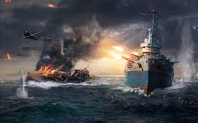

The results of the Battleship Commander Competition are in!  Your mathematical prowess, strategic skill, and clever commanding has led to this moment.  Each algorithm was tested against $$10,000$$ randomly generated Battleship fleets.  I am very pleased to say that all of the algorithms that you came up with compared very favorably in comparison to a completely random algorithm, which on average takes approximately $$59.82$$ shots per Battleship fleet.  A summary of the results are below.  Note: if your team is not listed, it was disqualified for not having a sufficiently explicit algorithm.

| team name | average number of shots |
| --------- | ----------------------- |
| Anything | 51.909 |
| Bungalo Bongo Boys | 52.367 |
| Doja's Kittens | 50.30 |
| Frozen Grapes | 52.82 |
| Glass Animals | 51.29 | 
| Gummy Butterflies | 52.44 | 
| $$J^2FK^2$$ | 49.47 |
| Pickle Lovers | 52.82 |

### The best strategy this year

This year's top strategy comes from the group $$J^2FK^2$$, whose members found an excellent dynamic firing algorithm which changes based on whether or not the $$2\times 1$$ Destroyer is still in play, and further based on whether the $$3\times 1$$ submarine and and cruiser are in play.

Starting out we follow the static firing algorithm described by the following table.
 
|  | A| B| C| D| E| F| G| H| I| J|
|--|--|--|--|--|--|--|--|--|--|--|
| 1|10|  |46|  |26|  |32|  |48|  |
| 2|  | 8|  |37|  |17|  |41|  |49|
| 3|44|  | 6|  |24|  |30|  |43|  |
| 4|  |34|  | 4|  |15|  |33|  |35|
| 5|22|  |20|  | 2|  |19|  |21|  |
| 6|  |13|  |11|  | 1|  |12|  |14|
| 7|29|  |27|  |23|  | 3|  |28|  |
| 8|  |39|  |36|  |16|  | 5|  |40|
| 9|47|  |45|  |25|  |31|  | 7|  |
|10|  |50|  |38|  |18|  |42|  | 9|

If at any point the $$2\times 1$$ ship is sunk, we switch over to the static firing algorithm described by the next table, starting with the lowest number which we haven't fired at and skipping any spaces which we have already fired at.

|  | A| B| C| D| E| F| G| H| I| J|
|--|--|--|--|--|--|--|--|--|--|--|
| 1|10|  |  |27|  |  |23|  |  |34|
| 2|  | 8|  |  |18|  |  |30|  |  |
| 3|  |  | 6|  |  |13|  |  |31|  |
| 4|25|  |  | 4|  |  |22|  |  |26|
| 5|  |16|  |  | 2|  |  |15|  |  |
| 6|  |  |11|  |  | 1|  |  |12|  |
| 7|20|  |  |19|  |  | 3|  |  |21|
| 8|  |29|  |  |17|  |  | 5|  |  |
| 9|  |  |32|  |  |14|  |  | 7|  |
|10|33|  |  |28|  |  |24|  |  | 9|

Next, if the $$2\times 1$$ is sunk and also both the $$3\times 1$$ ships have been sunk, we switch to the next table.  Again, we start from the first number and skip any spots where we have already fired.

|  | A| B| C| D| E| F| G| H| I| J|
|--|--|--|--|--|--|--|--|--|--|--|
| 1|10|  |  |  |18|  |  |  |24|  |
| 2|  | 8|  |  |  |13|  |  |  |25|
| 3|  |  | 6|  |  |  |20|  |  |  |
| 4|  |  |  | 4|  |  |  |21|  |  |
| 5|16|  |  |  | 2|  |  |  |15|  |
| 6|  |11|  |  |  | 1|  |  |  |12|
| 7|  |  |19|  |  |  | 3|  |  |  |
| 8|  |  |  |22|  |  |  | 5|  |  |
| 9|23|  |  |  |17|  |  |  | 7|  |
|10|  |26|  |  |  |14|  |  |  | 9|

Finally, if the $$2\times 1$$, both the $$3\times 1$$ and the $$4\times 1$$ have been sunk, we switch to the board

|  | A| B| C| D| E| F| G| H| I| J|
|--|--|--|--|--|--|--|--|--|--|--|
| 1|10|  |  |  |  |12|  |  |  |  |
| 2|  | 8|  |  |  |  |16|  |  |  |
| 3|  |  | 6|  |  |  |  |20|  |  |
| 4|  |  |  | 4|  |  |  |  |17|  |
| 5|  |  |  |  | 2|  |  |  |  |13|
| 6|11|  |  |  |  | 1|  |  |  |  |
| 7|  |15|  |  |  |  | 3|  |  |  |
| 8|  |  |19|  |  |  |  | 5|  |  |
| 9|  |  |  |18|  |  |  |  | 7|  |
|10|  |  |  |  |14|  |  |  |  | 9|

By the end of this algorithm, every ship is guaranteed to have sunk.

### The runner-up

The runner-up algorithm was a purely static algorithm with an interesting spiral pattern moving away from the center of the board.

|  | A| B| C| D| E| F| G| H| I| J|
|--|--|--|--|--|--|--|--|--|--|--|
| 1|  |48|  |38|  |21|  |37|  |47|
| 2|49|  |39|  |22|  |20|  |36|  |
| 3|  |40|  |23|  | 7|  |19|  |35|
| 4|41|  |24|  | 8|  | 6|  |18|  |
| 5|  |25|  | 9|  | 1|  | 5|  |17|
| 6|26|  |10|  | 2|  | 4|  |16|  |
| 7|  |27|  |11|  | 3|  |15|  |34|
| 8|42|  |28|  |12|  |14|  |33|  |
| 9|  |43|  |29|  |13|  |32|  |46|
|10|50|  |44|  |30|  |31|  |45|  |

It is very interesting that the performance of this spiralling algorithm is so competitive with the much more elaborate algorithm above!  One might wonder whether combining a spiral pattern with the idea of swapping to wider spirals once smaller ships are sunk might lead to an algorithm whose performance exceeds all the ones we have seen so far.

